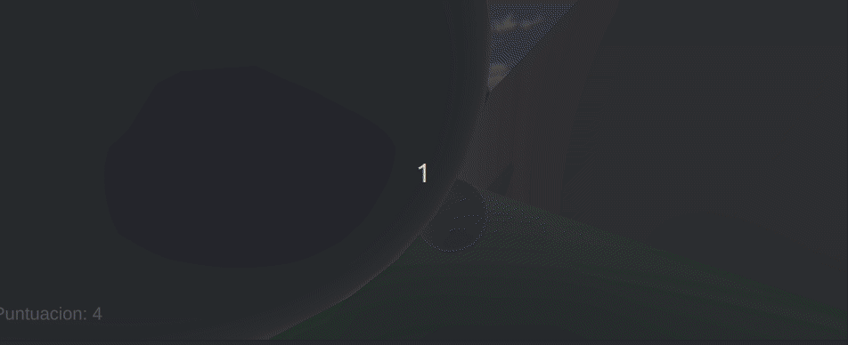

# Roll A ball

En el roll-a-ball un jugador controla una bola e intenta recoger
los objetos que están en el tablero mientras evita los obstáculos. 

Para moverse por el mapa podrá utilizar las teclas awsd o las flechas del teclado.

En este caso, su objectivo principal es recoger las monedas amarillas que vamos a encontrar por el mapa.
Cada vez que recojamos una se añadirá abajo en la izquierda en nuestra puntuación.

El juego consta de varias interacciones, como por ejemplo:

- Al recoger las monedas aumenta la puntuación.
- Hay un objecto llamado muro que al chocar la bola contra él se abre.

- Cuando pasamos por un suelo de diferente color aumenta la velocidad de la bola.

Además el juego está compuesto de varios obstáculos como paredes que rotan, 
muros y esferas que se deslizan y rampas.